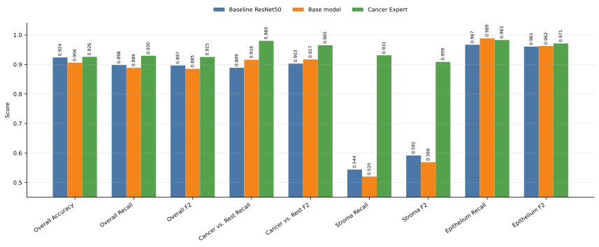

# Improving PathMNIST Classification

This project studies how to improve image-classification performance on
**PathMNIST**, a [MedMNIST v2](https://medmnist.com/v2) histopathology
benchmark. The task is to classify colorectal cancer tissue image patches into 9
tissue classes. The starting point is the official MedMNIST benchmark; the
project will reproduce a baseline and then test result-improvement strategies
such as stronger augmentation, transfer learning, ensembles, and cluster-aware
specialist models.

The main question is:

> How can we predict cancer tissue more reliably?

To answer this question, we compare the baseline ResNet50 with our developed
model. Since it is more important to correctly classify all cancer tissues than
preventing the misclassification of healthy tissue as cancer, we focus on the
following metrics:

* Accuracy
* Recall
* F2
* Cancer vs. Rest Recall
* Cancer vs. Rest F2
* Stroma Recall
* Stroma F2
* Epithelium Recall
* Epithelium F2

where the Cancer vs. Rest measurement is merging Stroma and Epithelium in one
class and the other classes in another class. Stroma and Epithelium are the two
cancer related classes.

## Usage

Install the project dependencies with:

```bash
python -m venv .venv
source .venv/bin/activate
pip install -e .
```

On the first run, PathMNIST is downloaded to `src/dataset/`, which can take a
while.

Train the base model with the default setup:

```bash
python src/cli/train_basemodel.py
```

Then train the cancer expert and regenerate the final comparison metrics:

```bash
python src/cli/train_cancer_expert.py
python src/cli/evaluate_final_models.py
```

Outputs are written to `models/` and `results/`.

To reduce the project size, `src/dataset/pathmnist_224.npz` and `.venv/` can be
deleted and recreated when needed.

## Project Structure

```text
.
├── src/                  # Training, evaluation, data loading, and models
│   └── cli/              # Command-line entry points
├── results/              # Metrics, predictions, and confusion matrices
├── models/               # Trained model checkpoints
├── report/               # LaTeX report and report figures
├── presentation/         # Beamer presentation and slides
└── preview/              # Small LaTeX preview files
```

## Models
We have the following models:
* Baseline ResNet50
* Cancer-Expert
* Basemodel
* Debris-Stroma-Expert
* Smooth-Muscle-Stroma-Expert
* Epithelium-Stroma-Expert

Baseline ResNet50 is the baseline model from the MedMNIST study which we use to
see if we improved. The Basemodel does the main decisions. However, if it is not
sure when classifying the Debris, Smooth Muscle or Epithelium class (confidence
< 90%), then it consolidates the respective expert model.

## Dataset

Size:

| Split | Samples |
| --- | ---: |
| Train | 89,996 |
| Validation | 10,004 |
| Test | 7,180 |

Classes:

| Label | Tissue type |
| ---: | --- |
| 0 | adipose |
| 1 | background |
| 2 | debris |
| 3 | lymphocytes |
| 4 | mucus |
| 5 | smooth muscle |
| 6 | normal colon mucosa |
| 7 | cancer-associated stroma |
| 8 | colorectal adenocarcinoma epithelium |

## Results

The cancer expert improves the main cancer-oriented metrics compared with both
the official ResNet50 reference and the custom base model.


