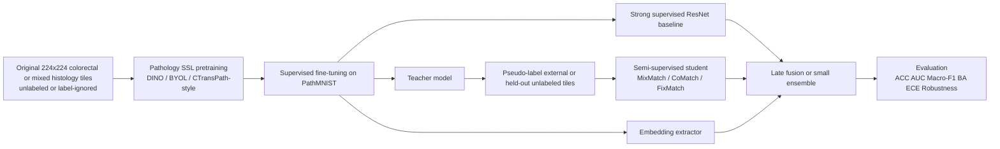
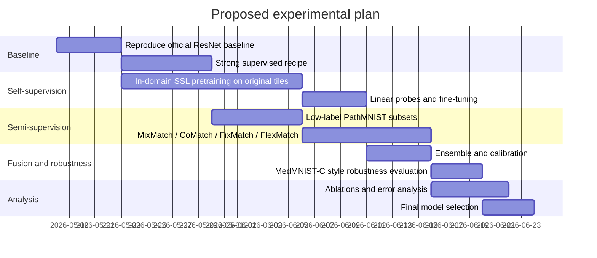

# Hybrid Supervised and Unsupervised Strategies for PathMNIST Patch Classification

*This report is already Markdown-ready and can be saved directly as `pathmnist_hybrid_report.md`.*

## Executive summary

PathMNIST is a fast, useful benchmark for exploring hybrid learning, but it is also a setting where very large gains are hard to obtain once all official labels are already used. The official MedMNIST v2 version contains 107,180 RGB colorectal histology patches resized to 28×28, with 9 tissue classes and an official train/validation/test split of 89,996/10,004/7,180. In the official benchmark, ResNet-18 at 28×28 reaches 0.983 AUC and 0.907 accuracy, while ResNet-50 at 28×28 reaches 0.990 AUC and 0.911 accuracy; moving to 224×224 changes these results only marginally on this benchmark. citeturn4view0turn2view0turn24view4

The most important practical conclusion from the recent literature is that **the best hybrid strategy depends on whether you are label-limited or resolution-limited**. In low-label medical-image settings, semi-supervised methods can provide large gains: in a careful CVPR 2024 benchmark that included PathMNIST, CoMatch, MixMatch, DINO, and BYOL were among the strongest methods, and the reported median gains on the PathMNIST task over the best labeled-only baseline were substantial, with CoMatch at +14.1 balanced-accuracy points, DINO at +12.6, MixMatch at +12.4, BYOL at +12.1, and FixMatch at +9.3. The same benchmark also found that MixMatch delivered the most reliable gains across four medical datasets overall. citeturn24view1turn24view3turn25view0

For **full-label PathMNIST**, however, the literature suggests a different priority order. The highest-return path is usually: first, strengthen the supervised ResNet recipe; second, add pathology-aware augmentation and a small ensemble or test-time augmentation; third, if you can access external or original-resolution unlabeled histology tiles, do domain-specific self-supervised pretraining and then fine-tune or distill into the final classifier. Pure semi-supervised learning on the same already-labeled 28×28 benchmark split is less likely to beat a strong supervised baseline by much, because the official baseline is already strong and the 28×28 bottleneck removes much of the fine-scale morphology that large SSL encoders are best at exploiting. This conclusion is supported by the MedMNIST baseline behavior, the CVPR 2024 medical SSL benchmark, pathology-specific SSL studies, and recent pathology foundation-model benchmarks. citeturn2view0turn24view3turn14view0turn14view1turn21view0

If your goal is specifically to **match or beat a ResNet baseline on PathMNIST**, the most defensible experimental ladder is:

| Recommended priority | Strategy | Why it is high-value on PathMNIST | Complexity |
|---|---|---|---|
| Highest | Strong supervised baseline with small-image ResNet, MixUp/CutMix, calibration, targeted pathology augmentations, and light ensembling | Baseline is already strong; modest but real gains usually come from better supervision and robustness engineering before more exotic methods. Medical ensemble studies report up to +13 F1 for stacking and consistent gains from augmenting/bagging, while MedMNIST-C shows pathology-targeted augmentation outperforms generic augmentation on corrupted PathMNIST. citeturn22search2turn38view0 | Low to medium |
| High | Self-supervised pretraining on original 224×224 colorectal or mixed histology tiles, then supervised fine-tuning or distillation to PathMNIST | Pathology-specific SSL often beats ImageNet pretraining in histopathology; Ciga et al. reported >28% average F-score boosts over ImageNet pretraining across downstream tasks, and CTransPath reported state-of-the-art transfer across multiple pathology tasks. citeturn14view0turn14view1 | Medium to high |
| High when labels are limited | MixMatch / CoMatch / FixMatch / FlexMatch on low-label splits or with extra unlabeled tiles | Direct PathMNIST evidence exists in the CVPR 2024 benchmark, where these methods were among the best under limited-label conditions. citeturn24view1turn24view3turn25view0 | Medium |
| Medium | Stain-view co-training or dual-branch H/E learning | Histopathology-specific multi-view methods work well on patch tasks when complementary stain views are meaningful, but the 28×28 PathMNIST representation limits how much stain separation can help. citeturn15view4turn16view5turn37view0turn37view1 | Medium |
| Medium | Domain adaptation and robustness training | Useful if you add external tiles or care about deployment robustness; less important for in-benchmark scores alone. citeturn34view0turn34view1turn38view0 | Medium |
| Lower | Clustering-first pipelines alone | Better as a pretraining component than as a stand-alone final strategy on 28×28 patches. citeturn31view4turn31view3turn14view3turn14view2 | Medium |

## PathMNIST and the baseline landscape

PathMNIST is derived from the NCT-CRC-HE-100K and CRC-VAL-HE-7K colorectal histology collections. The MedMNIST v2 paper states that PathMNIST is a 9-class colon-pathology task created by resizing the original 3×224×224 tissue patches to 3×28×28; the 100K training source was split 9:1 into train and validation, while CRC-VAL-HE-7K became the test set. The dataset therefore preserves histology semantics but removes a great deal of fine-grained morphological detail through aggressive downsampling. citeturn3view0turn4view0turn5search2turn5search3

This matters for method choice. The full-resolution source data offer a substantially richer signal than PathMNIST’s 28×28 benchmark representation, so methods that depend on nuanced local morphology, stain texture, nuclei appearance, or multi-scale context usually show their real value on the original 224×224 tiles rather than on the benchmark-sized images. The official benchmark numbers themselves support this: larger 224×224 ResNets do not substantially outperform 28×28 ResNets on PathMNIST in MedMNIST v2, and a recent medical SSL benchmark explicitly cites Yang et al.’s finding that larger 224×224 resolution does not yield much more accurate classifiers on PathMNIST and TissueMNIST. citeturn2view0turn24view4

The highest-confidence read of the benchmark is therefore:

| Setting | Main result | Interpretation |
|---|---|---|
| Official full-label MedMNIST v2 | ResNet-18 (28): AUC 0.983, ACC 0.907; ResNet-50 (28): AUC 0.990, ACC 0.911. citeturn2view0 | Strong supervised baseline; little slack remains for easy wins. |
| Limited-label PathMNIST in CVPR 2024 medical SSL benchmark | CoMatch, MixMatch, DINO, and BYOL are strong; pretraining helps some methods but only modestly for the best ones, except FixMatch, which improved by about 5 BA points from pretraining. citeturn24view1turn24view3 | Hybrid methods are most valuable when labels are scarce. |
| PathMNIST robustness benchmark | For corrupted PathMNIST, pathology-targeted augmentation improved corrupted-set AUC by +7.2 with ResNet-18, versus +4.3 for RandAugment and +3.4 for MixUp. citeturn38view0 | Domain-specific augmentation is a very practical gain lever. |

A final caution: the popular NCT-CRC-HE-100K family may contain dataset-specific biases. A 2024 analysis reported issues including inappropriate color normalization, severe JPEG artifacts inconsistent across classes, and corrupted tissue samples. That does not invalidate the benchmark, but it means a stronger model can improve its score partly by exploiting nuisance cues rather than more biologically meaningful tissue structure. Any hybrid strategy should therefore include robustness checks, not just clean-test accuracy. citeturn5search5turn38view0

## Literature survey of hybrid methods for image classification

### Semi-supervised consistency and pseudo-labeling

The semi-supervised line of work is the most directly relevant if you want to combine labeled and unlabeled patches. Mean Teacher established the now-standard teacher-student pattern with an exponential-moving-average teacher and consistency loss. MixMatch unified augmentation, pseudo-labeling, entropy reduction, and MixUp. ReMixMatch extended MixMatch with distribution alignment and augmentation anchoring. FixMatch simplified the recipe to weak-augmentation pseudo-labeling plus strong-augmentation consistency. FlexMatch improved FixMatch with class-wise adaptive thresholds. CoMatch added graph-based contrastive regularization on top of pseudo-labeling, and PAWS fused metric-learning ideas with semi-supervised support labels. Noisy Student scaled iterative teacher-student self-training to very large settings. citeturn33view0turn29view1turn29view2turn6search4turn32view0turn30view1turn30view2turn29view4

For PathMNIST specifically, the strongest direct evidence comes from the CVPR 2024 benchmark on medical image classification. Under a realistic low-label medical setup, MixMatch was the most reliable method across datasets, while on PathMNIST the best methods included CoMatch, MixMatch, DINO, and BYOL. This matters because it suggests that if you create low-label PathMNIST subsets or add extra unlabeled colorectal/histology tiles, you should start with **MixMatch and CoMatch**, not only with FixMatch. It also shows that realistic hyperparameter tuning with a validation set no larger than the train set is viable and often necessary. citeturn24view1turn24view3turn25view0

### Self-supervised pretraining and contrastive learning

Self-supervised learning provides a different path: learn a strong encoder from unlabeled images, then fine-tune with labels. SimCLR, MoCo, BYOL, SwAV, DeepCluster, and DINO are the major general-image exemplars. The core design choices vary—instance discrimination, momentum encoders, online clustering, self-distillation without labels—but all aim to produce transferable visual features from unlabeled data. citeturn31view2turn29view3turn31view1turn31view3turn31view4turn31view0

Histopathology has moved beyond directly importing these methods. Ciga et al. showed that contrastive self-supervised pretraining on 57 unlabeled histopathology datasets improved downstream performance and reported more than 28% average gains in F-score over ImageNet-pretrained networks, while also observing diminishing returns after roughly 50,000 pretraining images. CS-CO combined generative cross-stain prediction with discriminative contrastive learning. HistoSSL used histopathology-specific positive-pair construction at global, cell, and stain levels. CTransPath replaced a pure CNN encoder with a CNN+Transformer hybrid and proposed semantically relevant contrastive learning for pathology, reporting state-of-the-art transfer on five downstream tasks spanning nine datasets. citeturn14view0turn37view0turn37view1turn14view1

For your use case, the practical implication is straightforward: **if you have access to original-resolution unlabeled colorectal patches or broader pathology tiles, pathology-specific SSL is probably the single most promising way to improve a ResNet baseline without needing more labels**. But the gain will be larger if the encoder sees the original 224×224 morphology before being adapted to the 28×28 PathMNIST benchmark. citeturn3view0turn14view0turn14view1

### Co-training, multi-view learning, clustering, and teacher-student hybrids

Hybrid methods become especially interesting in histopathology because the image itself naturally provides multiple views: hematoxylin and eosin components, magnification levels, neighboring tiles, and even language descriptions or paired stains. Stain-Based Contrastive Co-training separates H and E channels and uses two CNN branches connected by a contrastive co-training loss; the authors report improvement over state-of-the-art semi-supervised methods on renal-cell and prostate-carcinoma tasks. CLASS-M extends this idea with adaptive stain separation plus pseudo-labeling with MixUp, and reports the best results on two ccRCC datasets, with particularly large gains on an underrepresented necrosis class. Self-Path uses multiple self-supervised auxiliary tasks for semi-supervised learning and domain adaptation in pathology patch classification. citeturn15view4turn18view0turn30view0

Clustering-based methods sit between supervised and unsupervised paradigms. DeepCluster and SwAV are the canonical natural-image papers. In pathology, Peikari et al.’s cluster-then-label method showed that clustering can help when labels are scarce, provided the semi-supervised assumptions are not badly violated. RetCCL later used clustering-guided contrastive learning to produce better pathology representations than ImageNet or earlier SSL features for WSI retrieval. These methods are most compelling when unlabeled histology data are plentiful and class manifolds are well-formed; they are less compelling as the sole final classifier on tiny 28×28 benchmark patches. citeturn31view4turn31view3turn14view3turn14view2

### Ensembles, domain adaptation, and feature fusion

Ensembles are the simplest and still one of the most reliable ways to combine supervised and unsupervised models. Deep ensembles improve calibration and uncertainty, while snapshot ensembles offer a cheaper alternative by harvesting multiple local minima from one training run. In medical image classification, a reproducible 2022 study found that stacking yielded gains up to +13 F1, bagging up to +11 F1, and augmentation-based ensembling up to +4 F1, with simple pooling often performing as well as or better than more complicated pooling rules. citeturn27search3turn27search4turn22search2

Domain adaptation matters whenever your unlabeled data come from other scanners, laboratories, or staining protocols. Domain-Adversarial Training of Neural Networks introduced the standard gradient-reversal recipe. In pathology, Ren et al. showed that adversarial unsupervised domain adaptation outperformed color normalization for cross-site histopathology classification and yielded significant improvement over baseline models. This is especially relevant if you pretrain on mixed external histology patches and then fine-tune on PathMNIST. citeturn34view0turn34view1

Recent pathology foundation-model work also changes the landscape. UNI was pretrained on more than 100 million pathology images drawn from over 100,000 H&E whole-slide images across 20 tissue types. Virchow used even larger-scale self-supervised training and outperformed UNI, Phikon, and CTransPath on a pan-cancer detection benchmark. At the same time, a 2025 clinical benchmark concluded that pathology SSL models are clearly preferable to natural-image pretraining, but also argued that current gains may be saturating, that dataset composition may matter more than sheer size, and that stronger progress may require combining SSL with other forms of supervision. That conclusion fits your problem well: on PathMNIST the best next step is not “largest possible foundation model,” but “smartest combination of supervision, pathology-aware pretraining, and practical fusion.” citeturn16view0turn16view1turn21view0

## Histopathology-specific evidence most relevant to PathMNIST

The table below focuses on papers that are unusually actionable for patch-level pathology classification.

| Paper | Task type | Main finding | Why it matters for PathMNIST |
|---|---|---|---|
| Ciga et al. 2022, *Self supervised contrastive learning for digital histopathology* citeturn14view0 | Patch-level transfer across many pathology datasets | Pretraining on 57 unlabeled pathology datasets beat ImageNet pretraining and improved average F-scores by more than 28%, with diminishing returns beyond ~50K images. citeturn14view0 | Strong evidence that in-domain unlabeled pathology data are much more useful than natural-image pretraining. |
| Wang et al. 2022, *CTransPath* citeturn14view1 | Histopathology representation learning | CNN+Transformer hybrid with semantically relevant positive pairs achieved state-of-the-art performance across five downstream tasks covering nine public pathology datasets. citeturn14view1 | Useful if you can pretrain on 224×224 pathology tiles and then fine-tune or distill. |
| Yang et al. 2022, *CS-CO* citeturn37view0 | Hybrid generative+contrastive SSL | Cross-stain prediction and contrastive learning complement each other and improve pathology transfer robustness. citeturn37view0 | Strong conceptual template for mixed-paradigm learning. |
| Jin et al. 2022, *HistoSSL* citeturn37view1 | Histopathology-specific SSL | Uses global, cell, and stain correspondences; achieved higher accuracies than recent SSL baselines on colorectal tissue phenotyping and CAMELYON16. citeturn37view1 | Shows that pathology-specific positive pairs matter more than generic image SSL recipes. |
| Koohbanani et al. 2020, *Self-Path* citeturn30view0 | Semi-supervised pathology classification and DA | Multi-task self-supervision achieved state-of-the-art semi-supervised performance with few labels and improved domain adaptation. citeturn30view0 | Relevant when you have few labels or site shift. |
| Zhang et al. 2022, *Stain Based Contrastive Co-training* citeturn15view4 | Semi-supervised patch classification | H/E-separated dual-view co-training improved over prior semi-supervised baselines on renal/prostate pathology tasks. citeturn15view4 | Direct evidence that histology-specific multi-view semi-supervision can work. |
| Zhang et al. 2024, *CLASS-M* citeturn18view0turn16view5 | Semi-supervised patch classification | Adaptive stain separation plus pseudo-labeling with MixUp achieved the best results on two ccRCC datasets; pseudo-labeling raised necrosis recall from 60.47% to 86.65% on TCGA ccRCC. citeturn18view0 | Strong evidence for combining stain-aware views with pseudo-labeling. |
| Ren et al. 2019, *Unsupervised Domain Adaptation for Classification of Histopathology Whole-Slide Images* citeturn34view1 | Cross-site shift | Adversarial adaptation was more robust than color normalization and improved classification under domain shift. citeturn34view1 | Important if you introduce external unlabeled histology data. |
| Campanella et al. 2025, *Clinical benchmark of public SSL pathology foundation models* citeturn21view0 | Clinical slide-level benchmark | SSL pathology encoders are better than natural-image pretraining, but performance differences between large public pathology FMs can be modest and may depend more on dataset composition than size alone. citeturn21view0 | Encourages pragmatic model choice rather than “largest model wins.” |

The practical synthesis is that **PathMNIST is best attacked with pathology-specific structure whenever possible**, but the way you inject that structure should respect the benchmark’s low resolution. If you only use released 28×28 PathMNIST images, stain-view methods and giant pathology transformers cannot realize their full advantage. If you can work from the original 224×224 colorectal tiles that PathMNIST comes from, the range of useful hybrid methods becomes much wider. citeturn3view0turn5search2turn37view0turn37view1

## Recommended strategy, implementation guidance, and experiments

The figure below summarizes the highest-value pipeline I would recommend.



Two details are crucial. First, if you use original NCT-CRC-HE-100K images, do **not** use CRC-VAL-HE-7K for any pretraining or pseudo-label generation, because that set is the official MedMNIST PathMNIST test source; using it would create leakage. Second, if you only have the released 28×28 PathMNIST images, skip large-pathology-foundation-model pretraining as the first experiment and instead begin with a stronger supervised baseline and corruption-aware augmentation. citeturn3view0turn4view0turn5search2

### Strong supervised baseline first

Before any hybrid method, build the strongest reasonable ResNet baseline you can. Because PathMNIST images are only 28×28, I recommend a **small-image ResNet stem** as an engineering choice: 3×3 stem with stride 1 and no initial max-pool, followed by ResNet-18 or ResNet-34 first, then ResNet-50 only if it clearly helps. That recommendation is an engineering inference from the 28×28 input regime, not an official MedMNIST prescription. The benchmark evidence implies that simply upscaling into a standard ImageNet-style pipeline is unlikely to be your best use of complexity. citeturn4view0turn24view4

For training, the most sensible baseline recipe is supervised cross-entropy with mild label smoothing, MixUp and/or CutMix on labeled minibatches, cosine learning-rate decay, early stopping on validation macro-F1 or balanced accuracy, and post-hoc temperature scaling for calibration. MixUp and CutMix are attractive here because they are cheap, robust, and already play well with later semi-supervised methods such as MixMatch and CLASS-M. citeturn27search11turn28search0turn29view1turn16view5

The augmentation policy should be pathology-aware rather than blindly aggressive. Weak augmentations for all experiments should include flips, small rotations, and mild brightness/contrast/saturation jitter. Strong augmentations can follow RandAugment-style sampling, but I would restrict the operation pool to transformations that preserve tissue semantics. For robustness, MedMNIST-C is especially useful: the PathMNIST corruption family includes JPEG compression, pixelation, defocus blur, motion blur, brightness, contrast, saturation, stain deposits, and bubbles. Those corruption types are a much better guide than generic vision augmentations alone. citeturn28search1turn38view0

### Add pathology-aware self-supervised pretraining

If you can access original-resolution unlabeled pathology tiles, the next experiment should be domain-specific SSL pretraining, followed by supervised fine-tuning on PathMNIST labels. If you want to stay close to a ResNet baseline, BYOL or MoCo/SimCLR-style pretraining on a ResNet-18/50 backbone is the cleanest route. If you are willing to change the encoder family, DINO or CTransPath-style tile encoders are stronger representation learners for pathology, but are less apples-to-apples with a pure ResNet baseline. citeturn31view1turn29view3turn31view2turn31view0turn14view1

A particularly high-value experiment is:

| Experiment | Encoder | Unlabeled data | Pretraining loss | Fine-tuning | Why it is worth doing |
|---|---|---|---|---|---|
| SSL-ResNet | ResNet-18 or ResNet-50 | NCT-CRC-HE-100K only, labels ignored | BYOL or MoCo-v2-style contrastive/self-distillation | Full end-to-end fine-tune on PathMNIST | Closest to your baseline; directly tests whether in-domain SSL helps. |
| SSL-pathology-specific | ResNet/CNN-Transformer hybrid | NCT-CRC-HE-100K or mixed public histology tiles | CS-CO, HistoSSL, or CTransPath-style objective | Fine-tune or distill to PathMNIST | Best chance of exploiting pathology structure. |
| Frozen-feature sanity check | Same pretrained encoder | Same | Same | Linear probe only, then full fine-tune | Separates representation quality from optimization effects. |

The best training pattern is to evaluate **linear probe, frozen-head fine-tuning, and full fine-tuning separately**. Pathology SSL papers repeatedly show strong transfer, but the best adaptation strategy depends on label count and target-domain similarity. Frozen features are more stable but often leave performance on the table; end-to-end fine-tuning is usually best when you have enough labels, which you do on full PathMNIST. citeturn14view0turn14view1turn37view0turn37view1

### Use semi-supervised learning where it is actually likely to help

Semi-supervised learning is most justified in three cases: when you intentionally create low-label PathMNIST subsets; when you add extra unlabeled colorectal or histology patches; or when you want a teacher-student pipeline after SSL pretraining. It is not likely to be the first thing that beats a fully labeled strong supervised baseline on the official split by a wide margin. That is not because the methods are weak, but because the label scarcity assumption becomes less true. The Noisy Student paper shows that semi-supervised self-training can still help even when labels are abundant, but its gains came from combining a strong teacher with **very large** unlabeled corpora and larger students, not from a small in-domain benchmark alone. citeturn29view4

For your actual experimental menu, I would prioritize:

| Method | Recommended setting | Suggested loss recipe | Notes |
|---|---|---|---|
| MixMatch | Low-label subsets or extra unlabeled colorectal tiles | Supervised CE + guessed labels + MixUp + entropy sharpening | Best reliability across medical tasks in the CVPR 2024 benchmark. citeturn29view1turn24view1 |
| CoMatch | Low-label PathMNIST or richer unlabeled pool | Supervised CE + pseudo-label smoothness + contrastive graph regularization | Directly attractive because it was strongest on the PathMNIST task in the medical benchmark. citeturn30view1turn24view1 |
| FixMatch | Strong augmenter available, simpler code path desired | Supervised CE + confidence-threshold pseudo-labeling on weak/strong views | Easier to implement, slightly less robust than MixMatch in the medical benchmark. citeturn6search4turn24view1 |
| FlexMatch | Same as FixMatch, but class imbalance or class difficulty matters | FixMatch objective + curriculum pseudo-label thresholds | Little extra complexity; useful when some PathMNIST classes learn faster than others. citeturn32view0 |
| PAWS | When you want metric-learning behavior with limited labels | Non-parametric support-label consistency on views | Elegant bridge between SSL and semi-supervised learning; usually heavier to tune. citeturn30view2 |

If you want a truly hybrid recipe, the strongest paper-backed design is: **SSL pretrain a teacher on original tiles, supervised fine-tune it, generate pseudo-labels on unlabeled pathology tiles, then train a smaller student on labeled + pseudo-labeled data with a MixMatch or CoMatch loss**. That combines self-supervision, supervision, and pseudo-labeling in the way the literature most often rewards. citeturn29view4turn24view1turn14view1

### Test stain-view and co-training variants, but keep expectations realistic

Pathology-specific multi-view learning is conceptually appealing because H&E images really do contain multiple weakly complementary signals. Stain Based Contrastive Co-training, CLASS-M, CS-CO, and HistoSSL all exploit this fact in different ways. The issue for PathMNIST is not whether the idea is valid—it is—but whether 28×28 images preserve enough stain-separable information to make the extra complexity worthwhile. I would therefore treat multi-view stain models as a **secondary** experiment on PathMNIST and a **primary** experiment on original-resolution tiles. citeturn15view4turn16view5turn37view0turn37view1

A practical version for PathMNIST is a dual-branch ResNet-18 with two inputs derived from RGB: one branch gets the original patch, the other a stain-deconvolved or color-normalized view. Fuse by averaging penultimate features or logits, then train with supervised CE plus a small contrastive or agreement loss between branches. This is a recommended engineering adaptation inspired by the stain-based literature rather than a direct copy of any single paper. It is most likely to help when you also apply targeted brightness/contrast/saturation/stain-artefact augmentation. citeturn16view5turn37view0turn38view0

### Ensemble and fuse at the end, not at the beginning

The simplest way to combine supervised and unsupervised classifiers is often the best one: train several different models and fuse them late. A practical final ensemble for PathMNIST could combine:

1. a strong supervised ResNet,
2. an SSL-pretrained then fine-tuned ResNet or ViT/CNN-hybrid,
3. a semi-supervised MixMatch or CoMatch student,
4. optional TTA predictions.

Then average logits or train a tiny logistic-regression meta-classifier on validation logits. Ensemble work in medical imaging suggests that stacking and bagging often outperform more elaborate pooling choices, while deep-ensemble literature shows benefits for calibration and uncertainty. citeturn22search2turn27search3turn27search4

If you only have time for one fusion experiment, use **late logit averaging of two or three diverse models**. It will usually deliver most of the ensemble benefit without the brittleness of a large stacker. This is especially attractive if your hybrid methods produce similar clean accuracy but different robustness or calibration behavior. citeturn22search2turn38view0

### Evaluate more than clean accuracy

The official MedMNIST metrics are AUC and accuracy, and you should report both for comparability. But a hybrid report that stops there is not rigorous enough. For PathMNIST, I recommend always reporting macro-F1, balanced accuracy, calibration error or Brier score, confusion matrices, and robustness under PathMNIST-specific corruptions. The CVPR 2024 benchmark used balanced accuracy for realistic low-label comparisons, and MedMNIST-C provides exactly the kind of corruption battery needed to detect whether your “improvement” is robust or just benchmark-specific. citeturn2view0turn24view1turn38view0

A concise ablation plan is below.

| Ablation family | What to vary | What it answers |
|---|---|---|
| Baseline strength | ResNet depth, stem, MixUp/CutMix on/off, label smoothing on/off | Whether hybrid gains are real or just fixing a weak baseline |
| SSL pretraining | Random init vs ImageNet vs in-domain SSL; frozen vs full fine-tune | Whether unlabeled pathology images help beyond supervised initialization |
| Semi-supervised learning | MixMatch vs FixMatch vs CoMatch vs FlexMatch | Which hybrid paradigm is best in your label/data regime |
| View design | RGB only vs stain-derived dual views | Whether histology-specific multi-view structure matters at 28×28 |
| Fusion | Single model vs 2-model average vs 3-model average vs stacking | Whether combination itself improves over the strongest single model |
| Robustness | Clean PathMNIST vs corrupted PathMNIST-style test sets | Whether gains survive stain/illumination/blur artefacts |
| Calibration | Temperature scaling on/off; NLL/ECE/Brier | Whether the classifier becomes more clinically trustworthy |

The experimental plan below is a sensible sequence if you want a disciplined progression rather than a grab bag of ideas.



In compute terms, the experiments separate naturally into qualitative tiers. A supervised or semi-supervised ResNet-18/34 on 28×28 PathMNIST is a **low-compute** task. In-domain SSL on original 224×224 colorectal tiles is **medium compute**. Large ViT-based pathology foundation-model pretraining is **high compute** and is usually not worth reproducing from scratch unless you specifically want a foundation-model project. As a useful anchor, CLASS-M on larger pathology patches reported about 13 GB of GPU memory and roughly 12 minutes per epoch on a TITAN RTX; PathMNIST-style 28×28 experiments should be much cheaper than that, while 224×224 pathology SSL pretraining will be closer to that regime. citeturn17view1turn18view0

## Pitfalls, failure modes, and when hybrid approaches may not help

The biggest pitfall is assuming that “more paradigms” automatically means “better performance.” On full-label PathMNIST, you may find that a carefully tuned supervised ResNet plus strong augmentation and a small ensemble is as good as, or better than, a much more elaborate semi-supervised stack. The reason is structural: the benchmark is already fairly large for its image size, the labels are available, and the downsampled 28×28 resolution leaves less room for representation-learning breakthroughs than a full-resolution pathology task would. The 2025 pathology foundation-model benchmark also warns that current SSL gains may be saturating and that algorithmic novelty or mixed forms of supervision may be required for larger jumps. citeturn4view0turn21view0

Pseudo-labeling can easily go wrong. If you use external unlabeled histology data with a different stain distribution, magnification, scanner profile, or class composition, high-confidence pseudo-labels may still be systematically wrong. This is especially dangerous in pathology because subtle color and texture cues can dominate confidence. Methods like FixMatch and FlexMatch reduce some of that risk with thresholding or class-wise thresholds, but they do not eliminate it. Domain adaptation or targeted augmentation becomes more important as soon as the unlabeled pool is not cleanly in-domain. citeturn6search4turn32view0turn34view1turn38view0

Co-training and stain-splitting can also disappoint if the two “views” are not sufficiently complementary. The pathology literature succeeds with H/E views because original-resolution histology supports real stain decomposition and morphology differences. At 28×28, stain-view branches may become noisy or redundant. That does not mean the idea is wrong; it means the benchmark may be too compressed for the view design to express itself fully. citeturn15view4turn16view5turn37view0

There is also a serious leakage risk if you use original colorectal source data carelessly. Because PathMNIST train/val come from NCT-CRC-HE-100K and test comes from CRC-VAL-HE-7K, any use of CRC-VAL-HE-7K during pretraining, pseudo-labeling, or hyperparameter selection contaminates the benchmark. Even if you avoid explicit label use, representation pretraining on the official test-origin set can invalidate clean comparability. citeturn3view0turn4view0turn5search2

Finally, do not trust clean-test gains alone. The 2024 MedMNIST-C work shows that medical-image models remain fragile under realistic corruptions, and PathMNIST specifically is exposed to pathology-relevant artefacts such as stain deposits and bubbles. A hybrid model that adds 0.3 clean accuracy points but collapses under realistic corruptions may be worse than a slightly weaker but more stable baseline. citeturn38view0

### Open questions and limitations

Direct, peer-reviewed head-to-head comparisons of **hybrid methods on full-label official PathMNIST** are still limited. The clearest PathMNIST-specific evidence comes from low-label settings and from broader pathology-patch studies rather than from many full-label benchmark papers. That means some of the strongest recommendations in this report—especially the priority order among strong supervision, in-domain SSL, and semi-supervised training at full label count—are evidence-based syntheses rather than exact published PathMNIST leaderboard claims. citeturn24view3turn14view0turn14view1turn21view0

## References and BibTeX

```bibtex
@article{yang2023medmnistv2,
  title={MedMNIST v2: A large-scale lightweight benchmark for 2D and 3D biomedical image classification},
  author={Yang, Jiancheng and Shi, Rui and Wei, Donglai and Liu, Zequan and Zhao, Lin and Ke, Bilian and Pfister, Hanspeter and Ni, Bingbing},
  journal={Scientific Data},
  volume={10},
  number={1},
  pages={41},
  year={2023},
  publisher={Nature Publishing Group}
}

@article{kather2019predicting,
  title={Predicting survival from colorectal cancer histology slides using deep learning: A retrospective multicenter study},
  author={Kather, Jakob Nikolas and others},
  journal={PLOS Medicine},
  volume={16},
  number={1},
  pages={e1002730},
  year={2019}
}

@inproceedings{he2016resnet,
  title={Deep Residual Learning for Image Recognition},
  author={He, Kaiming and Zhang, Xiangyu and Ren, Shaoqing and Sun, Jian},
  booktitle={Proceedings of the IEEE Conference on Computer Vision and Pattern Recognition},
  pages={770--778},
  year={2016}
}

@inproceedings{tarvainen2017meanteacher,
  title={Mean teachers are better role models: Weight-averaged consistency targets improve semi-supervised deep learning results},
  author={Tarvainen, Antti and Valpola, Harri},
  booktitle={Advances in Neural Information Processing Systems},
  year={2017}
}

@inproceedings{berthelot2019mixmatch,
  title={MixMatch: A Holistic Approach to Semi-Supervised Learning},
  author={Berthelot, David and Carlini, Nicholas and Cubuk, Ekin D. and Kurakin, Alex and Zhang, Han and Raffel, Colin},
  booktitle={Advances in Neural Information Processing Systems},
  year={2019}
}

@inproceedings{berthelot2020remixmatch,
  title={ReMixMatch: Semi-Supervised Learning with Distribution Matching and Augmentation Anchoring},
  author={Berthelot, David and Carlini, Nicholas and Cubuk, Ekin D. and Kurakin, Alex and Sohn, Kihyuk and Zhang, Han and Raffel, Colin},
  booktitle={International Conference on Learning Representations},
  year={2020}
}

@inproceedings{sohn2020fixmatch,
  title={FixMatch: Simplifying Semi-Supervised Learning with Consistency and Confidence},
  author={Sohn, Kihyuk and Berthelot, David and Li, Chun-Liang and Zhang, Zizhao and Carlini, Nicholas and Cubuk, Ekin D. and Kurakin, Alex and Zhang, Han and Raffel, Colin},
  booktitle={Advances in Neural Information Processing Systems},
  year={2020}
}

@inproceedings{zhang2021flexmatch,
  title={FlexMatch: Boosting Semi-Supervised Learning with Curriculum Pseudo Labeling},
  author={Zhang, Bowen and Wang, Yidong and Hou, Wenxin and Wu, Hao and Wang, Jindong and Okumura, Manabu and Shinozaki, Takahiro},
  booktitle={Advances in Neural Information Processing Systems},
  year={2021}
}

@inproceedings{li2021comatch,
  title={CoMatch: Semi-supervised Learning with Contrastive Graph Regularization},
  author={Li, Junnan and Xiong, Caiming and Hoi, Steven C.H.},
  booktitle={Proceedings of the IEEE/CVF International Conference on Computer Vision},
  pages={9475--9484},
  year={2021}
}

@inproceedings{assran2021paws,
  title={Semi-Supervised Learning of Visual Features by Non-Parametrically Predicting View Assignments with Support Samples},
  author={Assran, Mahmoud and Caron, Mathilde and Misra, Ishan and Bojanowski, Piotr and Joulin, Armand and Ballas, Nicolas and Rabbat, Michael},
  booktitle={Proceedings of the IEEE/CVF International Conference on Computer Vision},
  year={2021}
}

@inproceedings{xie2020noisystudent,
  title={Self-training with Noisy Student improves ImageNet classification},
  author={Xie, Qizhe and Luong, Minh-Thang and Hovy, Eduard and Le, Quoc V.},
  booktitle={Proceedings of the IEEE/CVF Conference on Computer Vision and Pattern Recognition},
  pages={10687--10698},
  year={2020}
}

@inproceedings{chen2020simclr,
  title={A Simple Framework for Contrastive Learning of Visual Representations},
  author={Chen, Ting and Kornblith, Simon and Norouzi, Mohammad and Hinton, Geoffrey},
  booktitle={Proceedings of Machine Learning Research},
  volume={119},
  pages={1597--1607},
  year={2020}
}

@inproceedings{he2020moco,
  title={Momentum Contrast for Unsupervised Visual Representation Learning},
  author={He, Kaiming and Fan, Haoqi and Wu, Yuxin and Xie, Saining and Girshick, Ross},
  booktitle={Proceedings of the IEEE/CVF Conference on Computer Vision and Pattern Recognition},
  pages={9729--9738},
  year={2020}
}

@inproceedings{grill2020byol,
  title={Bootstrap Your Own Latent: A New Approach to Self-Supervised Learning},
  author={Grill, Jean-Bastien and Strub, Florian and Altch{\'e}, Florent and Tallec, Corentin and Richemond, Pierre and Buchatskaya, Elena and Doersch, Carl and Pires, Bernardo Avila and Guo, Zhaohan Daniel and Azar, Mohammad Gheshlaghi and others},
  booktitle={Advances in Neural Information Processing Systems},
  year={2020}
}

@inproceedings{caron2020swav,
  title={Unsupervised Learning of Visual Features by Contrasting Cluster Assignments},
  author={Caron, Mathilde and Misra, Ishan and Mairal, Julien and Goyal, Priya and Bojanowski, Piotr and Joulin, Armand},
  booktitle={Advances in Neural Information Processing Systems},
  year={2020}
}

@inproceedings{caron2018deepcluster,
  title={Deep Clustering for Unsupervised Learning of Visual Features},
  author={Caron, Mathilde and Bojanowski, Piotr and Joulin, Armand and Douze, Matthijs},
  booktitle={Proceedings of the European Conference on Computer Vision},
  pages={132--149},
  year={2018}
}

@inproceedings{caron2021dino,
  title={Emerging Properties in Self-Supervised Vision Transformers},
  author={Caron, Mathilde and Touvron, Hugo and Misra, Ishan and J{\'e}gou, Herv{\'e} and Mairal, Julien and Bojanowski, Piotr and Joulin, Armand},
  booktitle={Proceedings of the IEEE/CVF International Conference on Computer Vision},
  pages={9650--9660},
  year={2021}
}

@inproceedings{lakshminarayanan2017deepensembles,
  title={Simple and Scalable Predictive Uncertainty Estimation using Deep Ensembles},
  author={Lakshminarayanan, Balaji and Pritzel, Alexander and Blundell, Charles},
  booktitle={Advances in Neural Information Processing Systems},
  year={2017}
}

@inproceedings{huang2017snapshot,
  title={Snapshot Ensembles: Train 1, Get M for Free},
  author={Huang, Gao and Li, Yixuan and Pleiss, Geoff and Liu, Zhuang and Hopcroft, John E. and Weinberger, Kilian Q.},
  booktitle={International Conference on Learning Representations},
  year={2017}
}

@inproceedings{zhang2018mixup,
  title={mixup: Beyond Empirical Risk Minimization},
  author={Zhang, Hongyi and Ciss{\'e}, Moustapha and Dauphin, Yann N. and Lopez-Paz, David},
  booktitle={International Conference on Learning Representations},
  year={2018}
}

@inproceedings{yun2019cutmix,
  title={CutMix: Regularization Strategy to Train Strong Classifiers with Localizable Features},
  author={Yun, Sangdoo and Han, Dongyoon and Oh, Seong Joon and Chun, Sanghyuk and Choe, Junsuk and Yoo, Youngjoon},
  booktitle={Proceedings of the IEEE/CVF International Conference on Computer Vision},
  pages={6023--6032},
  year={2019}
}

@inproceedings{cubuk2020randaugment,
  title={RandAugment: Practical automated data augmentation with a reduced search space},
  author={Cubuk, Ekin D. and Zoph, Barret and Shlens, Jonathon and Le, Quoc V.},
  booktitle={Advances in Neural Information Processing Systems},
  year={2020}
}

@article{ciga2022sslhistopath,
  title={Self supervised contrastive learning for digital histopathology},
  author={Ciga, Ozan and Xu, Tony and Martel, Anne L.},
  journal={Machine Learning with Applications},
  volume={7},
  pages={100198},
  year={2022}
}

@article{koohbanani2020selfpath,
  title={Self-Path: Self-supervision for Classification of Pathology Images with Limited Annotations},
  author={Koohbanani, Navid Alemi and Unnikrishnan, Balagopal and Khurram, Syed Ali and Krishnaswamy, Pavitra and Rajpoot, Nasir},
  journal={arXiv preprint arXiv:2008.05571},
  year={2020}
}

@article{wang2022ctranspath,
  title={Transformer-based unsupervised contrastive learning for histopathological image classification},
  author={Wang, Xiyue and Yang, Sen and Zhang, Jun and Wang, Minghui and Zhang, Jing and Yang, Wei and Huang, Junzhou and Han, Xiao},
  journal={Medical Image Analysis},
  volume={81},
  pages={102559},
  year={2022}
}

@article{yang2022csco,
  title={CS-CO: A Hybrid Self-Supervised Visual Representation Learning Method for H\&E-stained Histopathological Images},
  author={Yang, Pengshuai and Yin, Xiaoxu and Lu, Haiming and Hu, Zhongliang and Zhang, Xuegong and Jiang, Rui and Lv, Hairong},
  journal={Medical Image Analysis},
  volume={81},
  pages={102539},
  year={2022}
}

@article{jin2023histossl,
  title={HistoSSL: Self-Supervised Representation Learning for Classifying Histopathology Images},
  author={Jin, Xiaoyu and others},
  journal={Mathematics},
  volume={11},
  number={1},
  pages={110},
  year={2023}
}

@article{peikari2018clusterthenlabel,
  title={A Cluster-then-label Semi-supervised Learning Approach for Pathology Image Classification},
  author={Peikari, Mehrdad and Salama, Salma and Nofech-Mozes, Solange and Martel, Anne L.},
  journal={Scientific Reports},
  volume={8},
  pages={7193},
  year={2018}
}

@article{ren2019udapath,
  title={Unsupervised Domain Adaptation for Classification of Histopathology Whole-Slide Images},
  author={Ren, Jian and Hacihaliloglu, Ilker and Singer, Eric A. and Foran, David J. and Qi, Xin},
  journal={Frontiers in Bioengineering and Biotechnology},
  volume={7},
  pages={102},
  year={2019}
}

@article{zhang2024classm,
  title={CLASS-M: Adaptive stain separation-based contrastive learning with pseudo-labeling for histopathological image classification},
  author={Zhang, Bodong and Manoochehri, Hamid and Ho, Man Minh and Fooladgar, Fahimeh and Chong, Yosep and Knudsen, Beatrice S. and Sirohi, Deepika and Tasdizen, Tolga},
  journal={arXiv preprint arXiv:2312.06978},
  year={2024}
}

@article{zhang2022staincotrain,
  title={Stain Based Contrastive Co-training for Histopathological Image Analysis},
  author={Zhang, Bodong and Knudsen, Beatrice and Sirohi, Deepika and Ferrero, Alessandro and Tasdizen, Tolga},
  journal={arXiv preprint arXiv:2206.12505},
  year={2022}
}

@article{chen2024uni,
  title={Towards a general-purpose foundation model for computational pathology},
  author={Chen, Richard J. and Ding, Tong and Lu, Ming Y. and Williamson, Drew F.K. and Jaume, Guillaume and Chen, Bowen and Zhang, Andrew and Shao, Daniel and Song, Andrew H. and Shaban, Muhammad and others},
  journal={Nature Medicine},
  volume={30},
  pages={850--862},
  year={2024}
}

@article{vorontsov2024virchow,
  title={A foundation model for clinical-grade computational pathology and rare cancers detection},
  author={Vorontsov, Eugene and others},
  journal={Nature Medicine},
  year={2024}
}

@article{campanella2025benchmark,
  title={A clinical benchmark of public self-supervised pathology foundation models},
  author={Campanella, Gabriele and Chen, Shengjia and Singh, Manbir and others},
  journal={Nature Communications},
  volume={16},
  pages={3640},
  year={2025}
}

@inproceedings{huang2024medicalsslbenchmark,
  title={Systematic comparison of semi-supervised and self-supervised learning for medical image classification},
  author={Huang, Zhe and Jiang, Ruijie and Aeron, Shuchin and Hughes, Michael C.},
  booktitle={Proceedings of the IEEE/CVF Conference on Computer Vision and Pattern Recognition},
  pages={10866--10878},
  year={2024}
}

@article{disalvo2024medmnistc,
  title={MedMNIST-C: Comprehensive benchmark and improved classifier robustness by simulating realistic image corruptions},
  author={Di Salvo, Francesco and Doerrich, Sebastian and Ledig, Christian},
  journal={arXiv preprint arXiv:2406.17536},
  year={2024}
}

@article{muller2022ensemblemedical,
  title={An Analysis on Ensemble Learning optimized Medical Image Classification with Deep Convolutional Neural Networks},
  author={M{\"u}ller, Dominik and Soto-Rey, I{\~n}aki and Kramer, Frank},
  journal={arXiv preprint arXiv:2201.11440},
  year={2022}
}
```