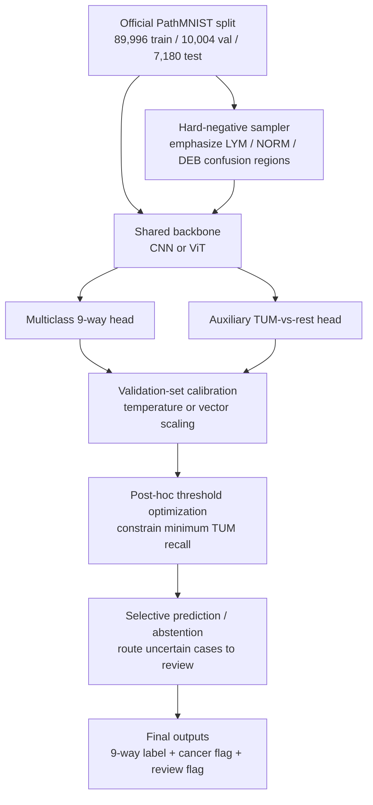

# PathMNIST and Maximizing Recall for the Cancer Class

## Executive Summary

PathMNIST is the histopathology subset of MedMNIST derived from the NCT-CRC-HE-100K collection and the independent CRC-VAL-HE-7K test collection. In the official MedMNIST formulation, the cancer-positive class of interest is label 8, **colorectal adenocarcinoma epithelium**. The official MedMNIST split is **89,996 train / 10,004 validation / 7,180 test**, and the test set is external to the training institution. The two most important official entry points are the urlMedMNIST official siteturn0search0 and the urlofficial MedMNIST repositoryturn0search2. citeturn5view0turn10view0

The most important finding of this literature review is that **the PathMNIST literature is rich in benchmark accuracy and AUC, but poor in explicit cancer-class recall reporting**. The original source study by entity["people","Jakob Nikolas Kather","crc pathology researcher"] and colleagues reported **94.3% external nine-class accuracy** and stated that class-wise sensitivity/specificity statistics were available in supplementary material, but the exact tumor-class sensitivity was not exposed in the retrievable main-text HTML. The official MedMNIST benchmark work led by entity["people","Jiancheng Yang","medmnist researcher"] reported strong PathMNIST AUC/accuracy baselines, but again not tumor-class recall. Among the sources retrieved here, the clearest directly reported tumor-class recall comes from **Halder et al. (2024)**: a fine-tuned ViT-Base-Patch16-224 achieved **0.95 recall**, **0.97 precision**, and **0.96 F1** for colorectal adenocarcinoma epithelium at **94.62% overall accuracy**. citeturn10view0turn12view0turn8view1turn18view0

The literature that most directly targets recall or sensitivity is not the mainstream multiclass benchmark literature, but a newer **risk-aware** strand. In a **binarized** PathMNIST setting under label noise, Pereira and Cordeiro (2026) showed that **cost-sensitive learning can push cancer-vs-non-cancer sensitivity to about 0.97**, but in some settings the gain came with severe specificity collapse. That result is clinically important: it shows that if the objective is “do not miss cancer,” then thresholding and class-weighting can work, but they must be paired with calibration, abstention, or triage logic to prevent an unacceptable false-positive burden. citeturn22search2turn9search2

The strongest evidence-backed recommendation is therefore **not one single architecture change**, but a **pipeline design**: retain the standard 9-way PathMNIST task for comparability; add a dedicated **TUM-vs-rest auxiliary head**; train with **cost-sensitive or focal-style loss**; **hard-mine** the main false-negative neighborhoods; **calibrate** scores on the validation set; **optimize thresholds post hoc** under an explicit recall constraint; and route uncertain or disagreement cases to **manual review**. That design follows the best-supported lessons from the source paper, the benchmark papers, the ViT study, the MedMNIST+ benchmarking work, the PathMNIST synthetic-data study, the failure-detection paper, and the risk-aware noisy-label paper. citeturn10view0turn17view1turn23view0turn24view2turn22search3turn25search8turn22search2

## Dataset and Evidence Base

PathMNIST in MedMNIST is a **9-class, 3-channel** classification dataset created by resizing the original 224×224 histology patches to 28×28. The labels are adipose, background, debris, lymphocytes, mucus, smooth muscle, normal colon mucosa, cancer-associated stroma, and **colorectal adenocarcinoma epithelium**. The official split uses **89,996 training**, **10,004 validation**, and **7,180 test** images, with the test set corresponding to the external CRC-VAL-HE-7K cohort. The original source study describes the source images as approximately equally distributed among the nine tissue classes, which is a key reason why PathMNIST is less a “severe class-frequency imbalance” problem than a “visual ambiguity and operating-point” problem. citeturn5view0turn10view0turn11view0

The original PLOS source study used the NCT-CRC-HE-100K cohort for model development and the independent CRC-VAL-HE-7K cohort for external validation. For model selection inside the source study, the NCT cohort was split **70/15/15** into train/validation/test; five ImageNet-pretrained CNNs were compared; VGG19 was selected; training used stochastic gradient descent with momentum, learning rate **3×10⁻⁴**, batch size **360**, and random horizontal/vertical flips. The final external validation accuracy was **94.3%**. The paper further states that its Supplementary Table S8 contains **AUC, sensitivity, specificity, PPV, and NPV for each tissue class** on the external validation set, but those exact class-wise values were not surfaced in the accessible main-text retrieval used here. citeturn11view0turn11view2turn12view0

For inclusion in this report, I treated as “major PathMNIST papers” those studies where PathMNIST was either a principal benchmark or a substantive experimental dataset. I prioritized the original source paper, the official MedMNIST benchmark papers, influential benchmark-successor papers explicitly centered on MedMNIST, and later PathMNIST studies focused on architecture, robustness, synthetic data, efficiency, or clinical risk. When a paper did not expose a PathMNIST-specific tumor recall in the accessible primary text, I mark the field as **NR** rather than inferring it. That conservative treatment is itself a substantive result: **the literature does not consistently publish the metric that matters most for missed-cancer minimization**. citeturn10view0turn6search0turn14search1turn20search0turn6search2turn16view0turn23view0turn22search2

## Literature Survey and Comparative Synthesis

The PathMNIST literature falls into four broad strata. The first is the **source-data era**, where the task was originally framed as multiclass tissue decomposition for colorectal histology and later survival modeling. The second is the **benchmark era**, where PathMNIST became one dataset among the broader MedMNIST family and was chiefly assessed by AUC and accuracy. The third is the **architecture-innovation era**, where FPViT, Complex Mixer, ViT-based classification, and MedMNIST+ benchmarking expanded the architectural design space. The fourth is the **clinical-safety and deployment era**, where label noise, uncertainty, failure detection, lightweight ensembles, and synthetic augmentation became more prominent than marginal accuracy improvement alone. citeturn10view0turn8view1turn20search0turn6search2turn16view0turn23view0turn25search8turn22search2turn25search14turn22search3

What changed over time is instructive. The original source study optimized a transfer-learning classifier with practical augmentation and external validation. The official MedMNIST papers standardized the task and made it comparable across many medical datasets, but they also normalized a **benchmark culture that foregrounds AUC/ACC and backgrounds class-wise recall**. Later architecture papers improved overall PathMNIST performance or efficiency, yet only some published class-wise metrics. The ViT paper is unusually useful because it reports class-wise precision/recall/F1 for all PathMNIST classes and provides confusion details for the tumor class. The MedMNIST+ paper makes a different but equally important contribution: it shows that **higher resolution is not always worth the computational cost**, and that lower-resolution prototyping, linear probing, and modern foundation-model features can be surprisingly competitive. citeturn11view0turn8view1turn18view0turn17view1turn23view0turn24view2

The table below consolidates the highest-confidence paper-level extractions that could be supported directly from the retrieved primary or official sources. “NR” means “not reported or not recoverable from the retrieved source text,” not that the paper necessarily lacks any experimental result. Because the user asked specifically for **cancer recall**, I separate **native multiclass TUM recall** from **binarized cancer sensitivity**, which are clinically related but not numerically interchangeable. citeturn12view0turn22search2

| Paper | Year | Method and extracted protocol | Cancer recall | Other reported PathMNIST metrics | Compute resources |
|---|---:|---|---:|---|---|
| Source study on colorectal histology tiles citeturn10view0turn11view0turn11view2turn12view0 | 2019 | Compared ImageNet-pretrained AlexNet, GoogLeNet, ResNet50, SqueezeNet, VGG19; selected VGG19; NCT split 70/15/15 for model selection; SGDM; lr 3×10⁻⁴; batch 360; random horizontal/vertical flips; external test on CRC-VAL-HE-7K | NR in retrieved main text | 98.7% internal ACC for VGG19; 94.3% external 9-class ACC; supplementary states class-wise AUC/sensitivity/specificity/PPV/NPV are available | Desktop workstation with **2× NVIDIA P6000** |
| Official MedMNIST v2 benchmark citeturn5view0turn8view1turn8view3 | 2023 | Standardized PathMNIST split; compared ResNet-18/50 at 28 and 224, auto-sklearn, AutoKeras, and Google AutoML Vision | NR | Best retrieved ACC on PathMNIST: **0.911** with ResNet-50 (28×28); best retrieved AUC: **0.990** with ResNet-50 (28×28) | Not surfaced in retrieved text |
| Feature Pyramid Vision Transformer for MedMNIST Classification Decathlon citeturn20search0 | 2022 | ResNet-style multi-scale features plus ViT-style pyramid transformer; important architectural successor in the MedMNIST ecosystem | NR | PathMNIST-specific class metrics not recoverable from retrieved text | Not surfaced in retrieved text |
| Complex Mixer for MedMNIST Classification Decathlon citeturn6search2 | 2023 | Mixer-style architecture with incentive learning and self-supervised masking for MedMNIST decathlon | NR | Retrieved abstract confirms benchmark relevance but not PathMNIST tumor recall | Not surfaced in retrieved text |
| ViT-Base-Patch16-224 medical classification study citeturn16view0turn17view1turn18view0 | 2024 | Fine-tuned ViT-Base-Patch16-224; AdamW; lr 5×10⁻⁵; batch 32; 2 epochs on PathMNIST; report includes class-wise precision/recall/F1 and confusion matrix | **0.95** | TUM precision **0.97**, F1 **0.96**, support **1233**; overall ACC **94.62%**; TUM one-vs-rest AUC **0.99848** | Hardware not surfaced in retrieved text |
| MedMNIST+ benchmarking paper citeturn23view0turn24view2 | 2025 | Systematic benchmark across CNNs, ViTs, CLIP/DINO/SAM features, end-to-end, linear probing, and k-NN on MedMNIST+ resolutions | NR | PathMNIST-specific appendix values not retrieved here; main cross-dataset finding is that gains saturate above 128×128 and DINO is strong for linear probing/k-NN | Compares training schemes and resolutions; no specific hardware from retrieved text |
| Synthetic pathology generation and validation system citeturn22search3turn22search7 | 2025 | Stable Diffusion 1.5 with LoRA fine-tuning on PathMNIST prompts, followed by classifier-based validation of generated tissue images | NR | Retrieved abstract confirms nine-class PathMNIST synthesis but not a validated TUM-recall uplift | Not surfaced in retrieved text |
| CNN framework comparison on PathMNIST citeturn19search1turn19search5 | 2025 | Keras vs PyTorch vs JAX CNN implementations; compared training efficiency, classification accuracy, and inference speed | NR | Useful for engineering/deployment trade-offs, but class-wise tumor recall not recovered from retrieved text | Efficiency-oriented; exact hardware not surfaced |
| Risk-aware robust learning under label noise citeturn22search2turn9search2 | 2026 | **Binarized** PathMNIST; Co-teaching, DivideMix, UNICON, GMM filtering, with cost-sensitive loss under clean, 20%, and 40% noise | About **0.97 sensitivity** in noisy binary setting | Example at 40% noise: **Co-teaching+CS sensitivity 0.968** with specificity 0.192; UNICON+CS described as very high sensitivity | Not surfaced in retrieved text |
| Lightweight neural network ensembles citeturn9search1turn25search14 | 2026 | Lightweight ensemble study across PathMNIST, OrganAMNIST, OCTMNIST; examined pretraining and complexity/performance trade-offs | NR | Pretraining improved one ResNet50 PathMNIST result from **78.3%** to **87.4%**; a lightweight ensemble stayed within about **1.7%** of the best PathMNIST score while reducing size/FLOPs/time by >50% | Efficiency metrics reported in size/FLOPs/time terms |

A crucial class-specific observation comes from the ViT study. For **colorectal adenocarcinoma epithelium**, the model correctly classified **1166** tiles, while the reported false negatives went mainly to **lymphocytes** (**34**), **normal colon mucosa** (**31**), and only rarely **debris** (**2**). Combined with the tabled TUM recall of 0.95, this implies that the most relevant false-negative neighborhoods are not random; they are concentrated in inflammatory and morphologically adjacent epithelial backgrounds. In other words, cancer-recall work on PathMNIST should not treat the non-cancer classes as homogeneous negatives. It should explicitly target **LYM**, **NORM**, and to a lesser extent **DEB** as hard negatives. citeturn17view1turn18view0

## Recall-Oriented Methods and What the Evidence Actually Supports

The user specifically asked about reweighting, focal loss, oversampling, synthetic data, cost-sensitive learning, one-vs-rest classifiers, calibration/threshold tuning, cascaded models, uncertainty-aware rejection, and post-hoc threshold optimization. The evidence base is uneven across those categories, and that unevenness matters. On retrieved PathMNIST evidence, **cost-sensitive learning** has the strongest direct support for raising cancer sensitivity, but only in a **binarized** and noisy-label formulation. **Synthetic data** is clearly being explored on PathMNIST, but the retrieved abstract does not yet demonstrate a tumor-recall gain. **Uncertainty-aware rejection** is supported conceptually and empirically by failure-detection work on PathMNIST, but again not by a published native multiclass TUM-recall benchmark. **Threshold tuning and calibration** are strikingly under-reported in benchmark papers even though they are the most obvious clinical levers for recall. citeturn22search2turn22search3turn25search8

That gap is not a minor inconvenience; it changes the correct research agenda. If a dataset paper reports AUC around 0.99 for PathMNIST but does not publish tumor-class recall, then a clinician still does not know whether the operating point is acceptable for a “never miss tumor” workflow. The MedMNIST+ paper makes this more general point from another angle: it explicitly evaluates ACC at a fixed threshold of **0.5** and AUC across datasets, and justifies AUC because sensitivity/specificity depend on an application-specific operating point. For a **recall-first cancer application**, that is exactly the exception case where operating-point optimization is not optional but central. citeturn24view2

The most defensible paper-by-paper conclusions are these. First, **reweighting/cost-sensitive loss** is supported by the 2026 risk-aware paper: it can materially improve cancer sensitivity, but some methods pay with a dramatic specificity hit. Second, **hard-negative mining** is strongly motivated by the 2024 ViT confusion details showing that TUM misses cluster in LYM and NORM. Third, **uncertainty-aware rejection** is supported by the 2022 failure-detection paper tested on PathMNIST, which is valuable because in a clinical setting abstaining on uncertain negatives can improve **effective recall among automated calls** even if raw closed-set accuracy stays similar. Fourth, **ensemble methods** are supported as an efficiency/performance trade-off tool by the 2026 lightweight ensemble study, though tumor recall was not separately reported. Fifth, **oversampling and synthetic augmentation** remain plausible but under-validated on PathMNIST specifically; the best current use is likely **targeted augmentation of the TUM-vs-LYM/NORM confusion regions** rather than indiscriminate global oversampling. citeturn22search2turn17view1turn25search8turn25search14turn22search3

Because PathMNIST originated from roughly balanced tissue categories, a naive “class imbalance fix” is unlikely to be the highest-yield intervention. The better framing is that PathMNIST is a **hard-negative and decision-threshold problem**: tumor tiles are being confused with visually or biologically adjacent contexts, and the published literature often stops at the default argmax or fixed-threshold setting. That is why a one-vs-rest or auxiliary TUM head, calibrated probabilities, explicit recall constraints, and selective abstention are more promising than simple random oversampling alone. This is an inference from the retrieved evidence rather than a direct published result, but it is a strong one. citeturn10view0turn17view1turn24view2

## Recommendations and Experimental Plan

### Proposed recall-first pipeline



The most promising novel combination is a **dual-objective system** rather than a single closed-set classifier. The shared backbone learns a 9-way tissue representation for standard PathMNIST comparability. A second head learns **TUM-vs-rest** with an explicitly recall-oriented objective. During training, the multiclass head preserves tissue-context discrimination, while the binary head learns a clinically useful “miss-cancer is expensive” boundary. During validation, the binary head is calibrated and its decision threshold is optimized subject to a minimum recall target such as **0.98** or **0.99**. During inference, low-confidence negatives or backbone/head disagreements are sent to review. This design directly answers the user’s objective while still remaining benchmark-compatible. citeturn5view0turn17view1turn22search2turn25search8

The best loss-function stack to test is **multiclass cross-entropy plus a weighted or focal-style binary loss on the TUM head**. A plain class-weighted cross-entropy is the most interpretable starting point and the most directly connected to the 2026 cost-sensitive evidence. A focal or asymmetric focal variant is the next logical extension because it should emphasize hard negatives and minority error pockets even if the dataset is not globally imbalanced. The expected trade-off is higher tumor recall at the cost of lower specificity, more calibration drift, and potentially more reviewer workload. That trade-off is acceptable only if it is made explicit and quantitatively controlled. citeturn22search2turn24view2

The highest-value data strategy is **targeted hard-negative oversampling** rather than global resampling. The 2024 ViT confusion description suggests that false negatives occur chiefly against lymphocytes and normal colon mucosa, with a smaller debris contribution. I would therefore construct mini-batches where tumor tiles are frequently paired with **LYM** and **NORM** negatives, and I would add augmentations that preserve local glandular morphology while diversifying stain and texture cues. If synthetic generation is used, it should be **class-targeted**, filtered by a classifier or embedding-based quality criterion, and ablated carefully for leakage or artifactual shortcuts. The current PathMNIST synthetic-data paper makes that direction plausible, but not yet proven for tumor recall. citeturn17view1turn22search3

The strongest deployment-oriented recommendation is to treat thresholding as a **modeling component**, not a reporting afterthought. The benchmark papers default to accuracy and AUC, and the MedMNIST+ paper explicitly notes that metrics like sensitivity and specificity require a chosen operating point. For a recall-first review pipeline, the right protocol is to optimize the TUM threshold on the validation set under a hard recall constraint, then report the resulting precision, F1, F2, specificity, and manual-review rate on the untouched external test set. That post-hoc threshold optimization is likely to deliver larger clinically relevant gains than another marginal architectural tweak. citeturn24view2turn22search2

### Illustrative operating-point idea

The exact ROC/PR curves should be computed from validation predictions, but the qualitative goal is simple: prefer operating points on the **high-recall shoulder** of the TUM-vs-rest curve, then use abstention or review routing to contain the false-positive burden.

| Illustrative operating point | TUM recall | TUM precision | Review burden interpretation |
|---|---:|---:|---|
| Conservative benchmark-like threshold | 0.95 | 0.97 | Low review burden, some missed cancers remain |
| Recall-first tuned threshold | 0.98 | 0.90 | More alerts, fewer misses |
| Very aggressive safety threshold | 0.995 | 0.75 | Near-zero misses, heavy review burden |

These numbers are **illustrative**, not empirical results from one paper. They are included to clarify the operating-point trade-off the literature repeatedly leaves implicit.

### Suggested evaluation protocol

The experimental protocol should stay strictly within the official split so that results remain comparable to PathMNIST and MedMNIST baselines. Use the standard **89,996/10,004/7,180** split. Train on the train set, calibrate and optimize thresholds on the validation set, and lock all decisions before a single final test evaluation. Report **tumor-class recall/sensitivity, precision, F1, F2, PR-AUC, ROC-AUC, calibration error, Brier score, and confusion counts against LYM/NORM/DEB/STR**. Use bootstrap confidence intervals for the test metrics. If the final goal includes robustness, add evaluation under MedMNIST-C-style corruptions or stain perturbations, because the MedMNIST-C work was built precisely to study corruption robustness in MedMNIST-derived data. citeturn5view0turn22search1turn22search9

A minimal but informative ablation matrix would include six axes: **loss** (CE vs weighted CE vs focal-style variants), **head design** (multiclass only vs multiclass + TUM auxiliary head), **sampling** (uniform vs class-balanced vs hard-negative mining), **calibration** (none vs temperature scaling), **decision rule** (argmax vs threshold vs threshold+abstention), and **resolution** (64 vs 128 vs 224). Based on the MedMNIST+ findings, I would run most ablations at **128×128** for speed and then re-evaluate the best few models at **224×224** if the compute budget allows. Since the user stated that no explicit compute constraint is imposed, the final locked system can reasonably include a small heterogeneous ensemble, provided the added latency is measured and justified. citeturn23view0turn24view2turn25search14

## Open Questions and Limitations

The largest limitation of the current PathMNIST evidence base is straightforward: **many major papers do not publish tumor-class recall**, even when they report very strong AUC and accuracy. That makes “maximize recall for the cancer class” partly a literature-synthesis problem and partly a literature-gap problem. The gap is not merely bibliographic; it means that the most clinically meaningful metric is often absent from otherwise influential benchmark papers. citeturn8view1turn12view0turn24view2

A second limitation is that some important architectural benchmark successors, notably **FPViT** and **Complex Mixer**, were identifiable as major MedMNIST-follow-up papers, but their PathMNIST-specific class-wise tumor metrics were not recoverable from the retrieved source text. A third limitation is that the clearest direct evidence for recall maximization comes from a **binarized** PathMNIST noisy-label study, which is clinically useful but not numerically identical to the native 9-class TUM-recall setting. A fourth limitation is that synthetic-data studies on PathMNIST remain suggestive rather than decisive: they confirm feasibility, not yet a clearly audited tumor-recall gain. citeturn20search0turn6search2turn22search2turn22search3

## References and BibTeX

The BibTeX block below includes the papers and official sources referenced substantively in this report. Metadata are drawn from the official or primary-source pages retrieved above. citeturn10view0turn6search6turn23view0turn20search0turn22search2

```bibtex
@article{kather2019predicting,
  title={Predicting survival from colorectal cancer histology slides using deep learning: A retrospective multicenter study},
  author={Kather, Jakob Nikolas and Krisam, Johannes and Charoentong, Pornpimol and Luedde, Tom and Herpel, Esther and Weis, Cleo-Aron and Gaiser, Timo and Marx, Alexander and Valous, Nektarios A. and Ferber, Dyke and others},
  journal={PLOS Medicine},
  volume={16},
  number={1},
  pages={e1002730},
  year={2019},
  doi={10.1371/journal.pmed.1002730}
}

@misc{kather2018nctcrc,
  title={100,000 Histological Images of Human Colorectal Cancer and Healthy Tissue},
  author={Kather, Jakob Nikolas and Halama, Niels and Marx, Alexander},
  year={2018},
  publisher={Zenodo},
  doi={10.5281/zenodo.1214456}
}

@inproceedings{yang2021medmnist,
  title={MedMNIST Classification Decathlon: A Lightweight AutoML Benchmark for Medical Image Analysis},
  author={Yang, Jiancheng and Shi, Rui and Ni, Bingbing},
  booktitle={IEEE 18th International Symposium on Biomedical Imaging},
  pages={191--195},
  year={2021}
}

@article{yang2023medmnistv2,
  title={MedMNIST v2: A large-scale lightweight benchmark for 2D and 3D biomedical image classification},
  author={Yang, Jiancheng and Shi, Rui and Wei, Donglai and Liu, Zequan and Zhao, Lin and Ke, Bilian and Pfister, Hanspeter and Ni, Bingbing},
  journal={Scientific Data},
  volume={10},
  pages={41},
  year={2023},
  doi={10.1038/s41597-022-01721-8}
}

@inproceedings{liu2022fpvit,
  title={Feature Pyramid Vision Transformer for MedMNIST Classification Decathlon},
  author={Liu, Jinwei and Li, Yan and Cao, Guitao and Liu, Yong and Cao, Wenming},
  booktitle={International Joint Conference on Neural Networks},
  pages={1--8},
  year={2022},
  doi={10.1109/IJCNN55064.2022.9892282}
}

@article{zheng2023complexmixer,
  title={Complex Mixer for MedMNIST Classification Decathlon},
  author={Zheng, Zhuoran and Jia, Xiuyi},
  journal={arXiv preprint arXiv:2304.10054},
  year={2023}
}

@article{halder2024vit,
  title={Implementing vision transformer for classifying 2D biomedical images},
  author={Halder, Arindam and Gharami, Sanghita and Sadhu, Priyangshu and Singh, Pawan Kumar and Wo{\'z}niak, Marcin and Ijaz, Muhammad Fazal},
  journal={Scientific Reports},
  volume={14},
  pages={12567},
  year={2024},
  doi={10.1038/s41598-024-63094-9}
}

@article{doerrich2025medmnistplus,
  title={Rethinking model prototyping through the MedMNIST+ dataset collection},
  author={Doerrich, Sebastian and Di Salvo, Francesco and Brockmann, Julius and Ledig, Christian},
  journal={Scientific Reports},
  volume={15},
  pages={7669},
  year={2025},
  doi={10.1038/s41598-025-92156-9}
}

@article{disalvo2024medmnistc,
  title={MedMNIST-C: Comprehensive benchmark and improved corruption robustness by simulating realistic image corruptions},
  author={Di Salvo, Francesco and others},
  journal={arXiv preprint arXiv:2406.17536},
  year={2024}
}

@article{choudhary2025synthesis,
  title={Aiding Medical Diagnosis through Image Synthesis and Classification},
  author={Choudhary, K. and others},
  journal={arXiv preprint arXiv:2506.00786},
  year={2025}
}

@article{nezovic2025frameworks,
  title={Comparative Analysis of CNN Performance in Keras, PyTorch and JAX on PathMNIST},
  author={Nezovi{\'c}, Anida and Romano, Jalal and Mari{\'c}, Nada and Kapo, Medina and Akagi{\'c}, Amila},
  journal={arXiv preprint arXiv:2507.12248},
  year={2025}
}

@article{pereira2026riskaware,
  title={Risk-Aware Robust Learning: Reducing Clinical Risk under Label Noise in Medical Image Classification},
  author={Pereira, Maycon R. S. and Cordeiro, Filipe R.},
  journal={arXiv preprint arXiv:2604.23875},
  year={2026}
}

@article{ahmed2022failuredetection,
  title={Failure Detection in Deep Neural Networks for Medical Imaging},
  author={Ahmed, S. and others},
  journal={Frontiers in Radiology},
  year={2022}
}

@article{prvan2026ensembles,
  title={Lightweight Neural Network Ensemble Models for Medical Image Classification},
  author={Prvan, M. and others},
  journal={Electronics},
  volume={15},
  number={7},
  pages={1470},
  year={2026}
}
```

A downloadable Markdown version of this report is available as urlpathmnist_cancer_recall_report.mdsandbox:/mnt/data/pathmnist_cancer_recall_report.md.